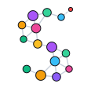
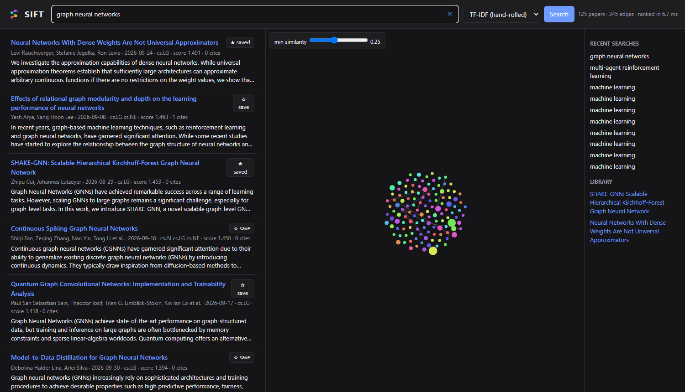
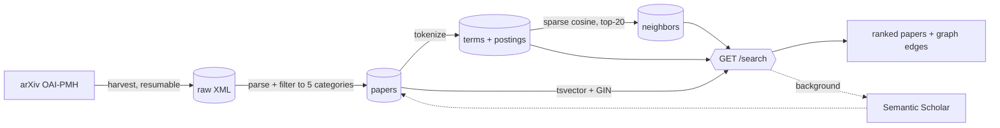

<p align="center">
  
</p>

<h1 align="center">SIFT</h1>

<p align="center">
  <b>Search, rank, and explore arXiv papers by relevance — with a graph of how they connect.</b><br>
  A hand-rolled TF-IDF search engine, benchmarked side by side against Postgres full-text search.
</p>

<p align="center">
  
</p>

---

Type a query like *"graph neural networks"*. SIFT ranks ~19.5k recent computer-science papers
from arXiv, returns the top 125, and draws them as a force-directed graph: each edge connects
two papers with similar content, each color is a cluster of connected papers, and node size
grows with citation count.

The ranking is **TF-IDF implemented from scratch** — tokenizer, inverted index, and scoring —
not a library and not an LLM. The same queries can be run against **Postgres full-text search**
with one toggle, so the two engines can be compared on identical data.

## Highlights

- **Inverted index in Postgres**: 37,695 terms and 1.91M postings over 19,476 papers, built
  in ~42 s with bulk `COPY`.
- **~20 ms queries** for the hand-rolled engine: only the query's terms are touched, and the
  dot product is computed in SQL.
- **Precomputed similarity graph**: cosine similarity for all ~190M paper pairs, chunked through
  sparse matrices, and the top 20 neighbours of each paper stored. That's 389k edges in ~16 s.
- **Two engines, one codebase**: `?engine=tfidf|pgfts`, with both returning identical candidate
  sets so the comparison measures ranking alone.
- **Lazy citation hydration**: citation counts come from Semantic Scholar in a background task
  after each search. Results return immediately, and graph nodes resize when counts arrive.

## How it works



### Ingest
Papers come from arXiv's [OAI-PMH](https://info.arxiv.org/help/oa/index.html) bulk interface
(the sanctioned path for large pulls) for cs.AI, cs.LG, cs.CL, cs.MA and cs.IR. The harvester
follows resumption tokens, respects arXiv's one-request-per-3-seconds policy, and resumes
from disk if interrupted. The corpus window is one config value (`HARVEST_MONTHS`).

### Tokenizing
arXiv abstracts are full of LaTeX. About 16% contain `$...$` math, which a naive tokenizer turns
into junk terms like `mathbb` and `varepsilon` that distort IDF. The tokenizer:
1. drops math and URLs
2. unwraps formatting commands (`\emph{x}` → `x`)
3. splits hyphenated words
4. drops numbers and stopwords
5. applies Porter stemming

Queries go through the same function.

### Ranking: lnc.ltc TF-IDF

| | weight |
|---|---|
| document term | `(1 + ln tf) / doc_norm`, where `doc_norm = √Σ(1 + ln tf)²` |
| query term | `(1 + ln tf) · idf`, where `idf = ln(N / df)` |
| score | Σ over shared terms of query weight × document weight |

**Design choice:** IDF lives only in the `terms` table, and document norms contain no IDF.
Refreshing IDF as the corpus grows therefore rewrites ~38k term rows, not 1.9M postings.
Title terms are counted twice, mirroring the higher title weight Postgres FTS gives titles.

### Graph
Each paper's TF-IDF vector (with IDF on both sides, as document-to-document similarity
needs) is L2-normalized into a sparse matrix. `X · Xᵀ` is computed in 1,000-row chunks,
so only one 1,000 × 19.5k block is in memory at a time. The top 20 neighbours per paper go into a
table, and a query's graph keeps just the edges whose endpoints are both in the results.

## TF-IDF vs. Postgres full-text search

Both engines match the same papers (any query word), so they differ only in **ranking**:

| | hand-rolled TF-IDF | Postgres FTS (`ts_rank_cd`) |
|---|---|---|
| ranking signal | term frequency × rarity, length-normalized | term proximity/cover density, title weighted |
| typical latency (125 results) | ~20 ms | ~340 ms in any-word mode |
| top-20 overlap with the other engine | 4–10 of 20 across test queries | |

A known TF-IDF weakness shows up in practice. For *"graph neural networks"*, the #1 result
mentions "graph" once but "neural network" many times, because plain TF-IDF has no notion
of matching all the terms. Toggling the engine in the UI shows how differently the two rank the
same candidates.

## Tech stack

**Backend:** Python 3.13 · FastAPI · PostgreSQL 16 · psycopg 3 (raw SQL, no ORM) · NumPy/SciPy · lxml
**Frontend:** force-directed graph with [force-graph](https://github.com/vasturiano/force-graph)
**Tooling:** uv · pytest (35 tests) · ruff · Docker Compose

## Run it locally

Requires Docker and [uv](https://docs.astral.sh/uv/).

```bash
docker compose up -d                                          # Postgres on localhost:5433
docker exec -i sift-db psql -U sift -d sift < database/schema.sql
cp .env.example .env                                          # optional: Semantic Scholar key

uv run python -m app.crawler.harvest      # download ~1 month of papers (~5 min)
uv run python -m app.crawler.load         # parse + load into Postgres (~3 min)
uv run python -m app.search.indexer       # build the inverted index (~45 s)
uv run python -m app.search.neighbors     # precompute graph edges (~16 s)

uv run uvicorn app.main:app --reload      # open http://localhost:8000
uv run pytest                             # tests
```

## API

| method | path | description |
|---|---|---|
| `GET` | `/search?q=&engine=tfidf\|pgfts&limit=` | ranked papers + edges between them |
| `GET` | `/papers/citations?ids=1,2,3` | citation counts (polled once after a search) |
| `GET` | `/library` | saved papers |
| `PUT` / `DELETE` | `/library/{paper_id}` | save / unsave a paper (idempotent) |
| `GET` | `/searches?limit=` | recent searches |

Interactive docs are served at `/docs`.

## Project layout

```
app/
  crawler/    harvest.py · parser.py · load.py · response.py   (OAI-PMH ingest)
  search/     tokenizer.py · indexer.py · tfidf.py · pgfts.py · neighbors.py
  services/   citations.py                                     (Semantic Scholar, background)
  api/        search.py · papers.py · library.py
  static/     web UI + logo
database/     schema.sql
tests/        unit tests + integration tests against the live index
```

## Roadmap

- [x] OAI-PMH ingest, LaTeX-aware tokenizer, inverted index, TF-IDF ranking
- [x] Postgres FTS comparison engine
- [x] Precomputed similarity graph, async citation counts, saved papers and search history
- [ ] React frontend
- [ ] Public deployment
- [ ] Citation lineage view: expand a paper's references hop by hop

## Acknowledgements

Thank you to arXiv for use of its open access interoperability. Citation data from
[Semantic Scholar](https://www.semanticscholar.org/).
